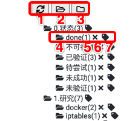

# joplin-plugin-tagtree
a Joplin plugin with panel to show tag and support level ,move,delete,add rela.

优先更新地址：https://gitee.com/shoko/joplin-plugin-tagtree

#### 介绍
Joplin插件，通过面板方式展示tag，支持层级、移动、删除、拖动、添加标签。

a Joplin plugin with panel to show tag and support level ,move,delete,add rela.

#### 安装教程

1.  直接使用，下载publish目录的2个文件，直接添加即可
2.  二次开发，下载源码

#### 使用说明

1.  刷新-整个树
2.  打开-整个树
3.  关闭-整个树
4.  打开/关闭 当前子树
5.  标签关联文章数量
6.  删除该标签
8.  为当前打开文章，增加该标签

